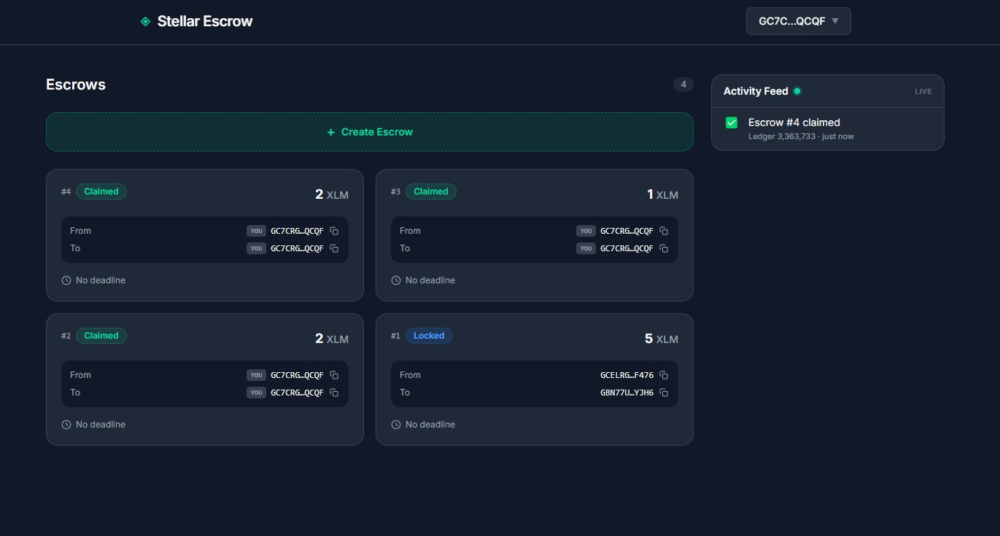
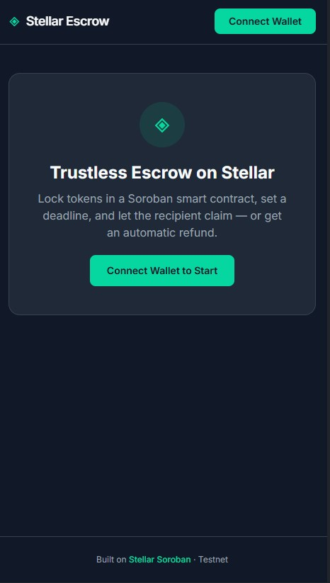
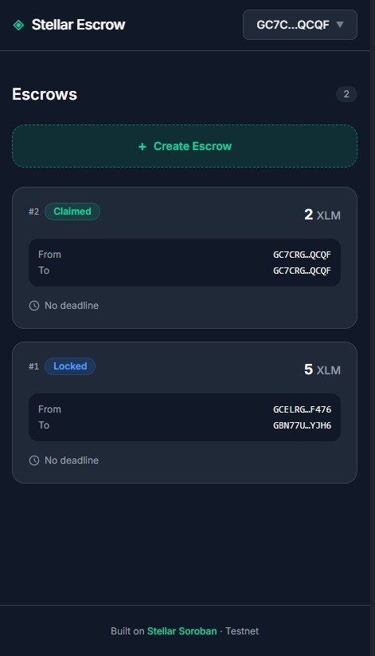
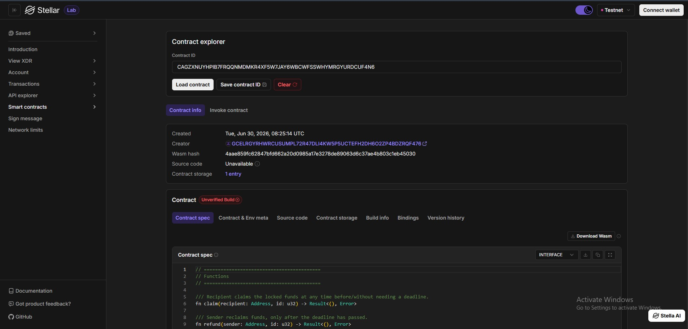
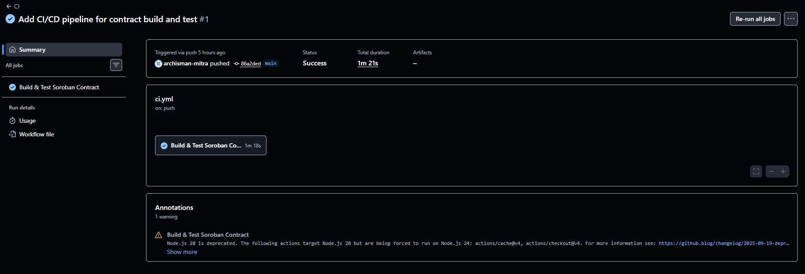
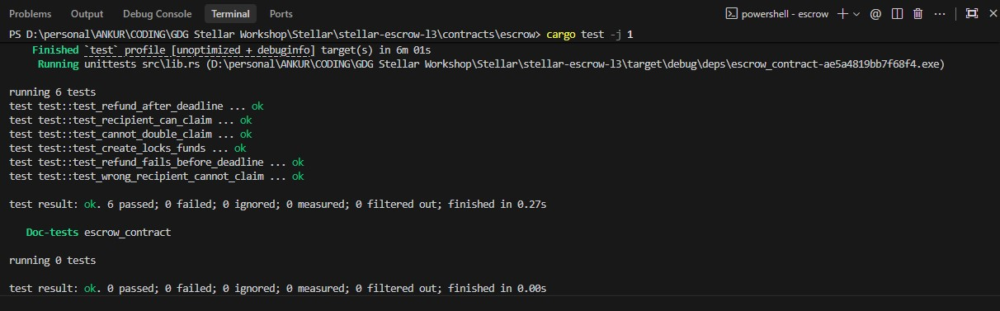
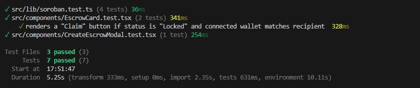

# Stellar Escrow: Trustless Token Escrow on Soroban


A production-ready decentralized escrow application built on **Stellar Soroban**. The application enables trustless peer-to-peer token escrow where funds remain securely locked on-chain until claimed by the intended recipient or refunded to the sender after a deadline.

Built for **Stellar Journey to Mastery – Monthly Builder Challenge**
**Level 3: Advanced Smart Contracts & Production Ready dApps**

---

## Live Demo

**Application**
https://stellar-escrow-indol.vercel.app/

**GitHub Repository**
https://github.com/archisman-mitra/stellar-escrow

---

# 🎥 Demo Video

A complete walkthrough of the application demonstrating the full escrow workflow, smart contract interactions, and production-ready features.

**Watch the demo:** https://youtu.be/L49EvbqMi7A

The demo showcases:

- Wallet connection using Stellar Wallets Kit
- Creating a new escrow with XLM
- Claiming locked funds as the recipient
- Refunding an escrow after the deadline
- Live Activity Feed powered by on-chain contract events
- Mobile responsive user interface
- End-to-end interaction with the deployed Soroban smart contract

---

# Challenge Requirements

This project satisfies all Level 3 requirements.

- ✅ Advanced smart contract development
- ✅ Inter-contract communication
- ✅ Event streaming & real-time updates
- ✅ CI/CD pipeline
- ✅ Smart contract deployment
- ✅ Mobile responsive frontend
- ✅ Error handling & loading states
- ✅ Smart contract tests
- ✅ Frontend tests
- ✅ Production-ready architecture
- ✅ Complete documentation
- ✅ Live deployment

---

# Screenshots

## Desktop UI



## Mobile Responsive UI





## Contract Deployment



## CI/CD Pipeline



## Contract Tests



## Frontend Tests



---

# Problem Statement

Blockchain token transfers are irreversible once executed. There is no native way to lock funds until another party confirms receipt or to automatically refund them if a transaction is never completed.

This project solves that problem entirely on-chain using Soroban smart contracts. Funds are held by the contract itself rather than either participant until predefined conditions are satisfied.

---

# Solution

The escrow lifecycle is simple and fully trustless.

1. Sender creates an escrow by specifying:
   - Recipient
   - Amount
   - Optional deadline

2. Funds are immediately locked inside the smart contract.

3. Recipient may claim the funds at any time while the escrow remains locked.

4. If a deadline exists and expires before the recipient claims, the sender may refund the escrow.

Every escrow progresses through one of the following states:

```
Locked
   │
   ├────────► Claimed
   │
   └────────► Refunded
```

All state transitions occur completely on-chain.

---

# Architecture

```
┌─────────────────┐      ┌──────────────────────┐      ┌────────────────────┐
│ React + Vite    │─────▶│ Escrow Contract      │─────▶│ Native XLM Token   │
│ Wallet Kit      │      │ Soroban (Rust)       │      │ Contract (SAC)     │
└─────────────────┘      └──────────────────────┘      └────────────────────┘
        │                            │
        │ polls getEvents()          │ emits events
        ▼                            ▼
┌──────────────────────────────────────────────────────┐
│          Live Activity Feed (Real-Time)              │
└──────────────────────────────────────────────────────┘
```

The frontend never transfers funds directly.

Every transaction flows through the escrow contract, which communicates with the Stellar Asset Contract using `token::Client::transfer()`. This is genuine **inter-contract communication**, fulfilling one of the primary Level 3 requirements.

---

# Project Structure

```
stellar-escrow/

├── contracts/
│   └── escrow/
│       ├── src/
│       └── test.rs
│
├── frontend/
│   ├── src/
│   ├── components/
│   ├── services/
│   └── hooks/
│
├── screenshots/
│
├── .github/
│   └── workflows/
│
└── README.md
```

---

# Smart Contract

**Language:** Rust (Soroban SDK 22)

**Network:** Stellar Testnet

**Contract Address**

```
CAGZXNUYHPIB7FRQQNMDMKR4XF5W7JAY6WBCWFSSWHYMRGYURDCUF4N6
```

## Public Functions

| Function          | Description                    |
| ----------------- | ------------------------------ |
| `create_escrow()` | Creates and funds a new escrow |
| `claim()`         | Recipient claims locked funds  |
| `refund()`        | Sender refunds after deadline  |
| `get_escrow()`    | Returns escrow information     |
| `get_count()`     | Returns total escrows          |

---

# Inter-Contract Communication

The escrow contract interacts directly with the native Stellar Asset Contract using

```rust
token::Client::transfer(...)
```

during:

- Escrow creation
- Claim
- Refund

This allows the escrow contract to orchestrate transfers while the Stellar Asset Contract securely performs balance updates.

---

# Contract Events

The contract emits the following events:

- `created`
- `funded`
- `claimed`
- `refunded`

The frontend polls Soroban RPC every five seconds using `getEvents()` to build a live activity feed.

---

# Error Handling

| Code | Description        |
| ---- | ------------------ |
| 1    | NotFound           |
| 2    | NotAuthorized      |
| 3    | AlreadySettled     |
| 4    | DeadlineNotReached |
| 5    | NoDeadlineSet      |
| 6    | InvalidAmount      |

---

# On-Chain Proof

| Action               | Hash                                                               |
| -------------------- | ------------------------------------------------------------------ |
| Contract Upload      | `e692f2779025af186251c10e4388fe095c48263e86a1190854d250b955565850` |
| Contract Deployment  | `388d0e5fe30dfefa0d456a094d7b6ba07ab4d862727c9b8aee1ca5db4db24a48` |
| CLI Escrow Creation  | `2c64f963f0df14671e6c4338d7b35408c39ef43208586ac3ede0b2579627644a` |
| UI Claim Transaction | `5a7e99c3255a23d747500298c2d66945b5dcf5f7af89ead80d53baa5c4ac231f` |

All transactions are publicly verifiable on Stellar Expert Testnet.

---

# Frontend

## Technology

- React
- TypeScript
- Vite
- Tailwind CSS
- Stellar Wallets Kit
- Stellar SDK
- Sonner

## Features

- Multi-wallet support
- Live contract interaction
- Live activity feed
- Responsive design
- Loading skeletons
- Transaction progress states
- Toast notifications
- Friendly error messages

---

# Testing

## Smart Contract

**6 Rust tests**

- Escrow creation
- Claim flow
- Refund flow
- Deadline validation
- Authorization
- Double-claim prevention

```bash
cd contracts/escrow
cargo test
```

---

## Frontend

**7 Vitest tests**

- Event decoding
- Error mapping
- Form validation
- Component rendering

```bash
cd frontend
npm run test -- --run
```

---

# CI/CD

GitHub Actions automatically:

- Builds the smart contract
- Runs Rust tests
- Builds the frontend
- Runs frontend tests
- Verifies production builds on every push

Workflow:

```
Push
   │
   ▼
GitHub Actions
   │
   ├── Cargo Test
   ├── Cargo Build
   ├── Frontend Test
   └── Frontend Build
```

---

# Running Locally

## Contract

```bash
cd contracts/escrow

cargo test

cargo build --target wasm32v1-none --release

stellar contract deploy \
--wasm target/wasm32v1-none/release/escrow_contract.wasm \
--source <your-key> \
--network testnet
```

## Frontend

```bash
cd frontend

npm install

npm run dev
```

---

# Tech Stack

### Smart Contract

- Rust
- Soroban SDK 22

### Frontend

- React
- TypeScript
- Vite
- Tailwind CSS

### Wallet Integration

- Stellar Wallets Kit

### Deployment

- Stellar Testnet
- Vercel

### Testing

- Rust Testutils
- Vitest
- React Testing Library

### CI/CD

- GitHub Actions

---

# Future Improvements

- Multi-signature escrow
- Partial milestone releases
- Escrow reminders
- Email notifications
- Mainnet deployment
- Advanced transaction history

---

# Author

**Archisman Mitra**

GitHub:
https://github.com/archisman-mitra

---

# License

This project is licensed under the MIT License.
